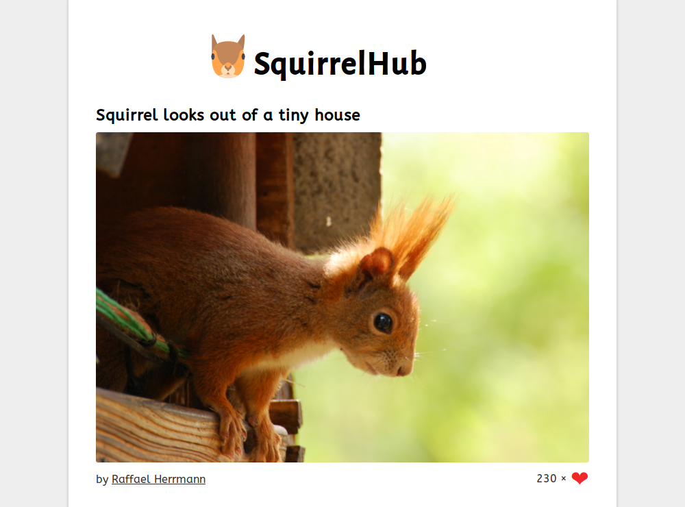

# SquirrelHub

## Description

A demo website built using Node.js, MongoDB, Express.js and AngularJS. Express
uses Handlebars to render the page, AngularJS loads and updates the data in
MongoDB through an Express' REST service.

## Disclaimer

This project uses:

- An icon made by [Freepik](http://www.freepik.com), licensed under
  [CC 3.0 BY](http://creativecommons.org/licenses/by/3.0/).
- Alegreya Sans font made by Juan Pablo del Peral under the SIL Open Font
  License, Version 1.1.
- ABeeZee Regular font made by Anja Meiners under the SIL Open Font License,
  Version 1.1.
- Several photos of squirrels under the CC0 license.
